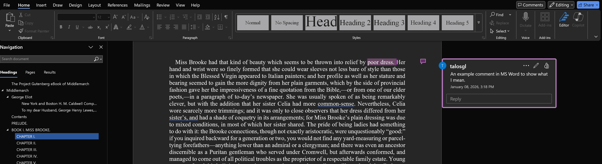
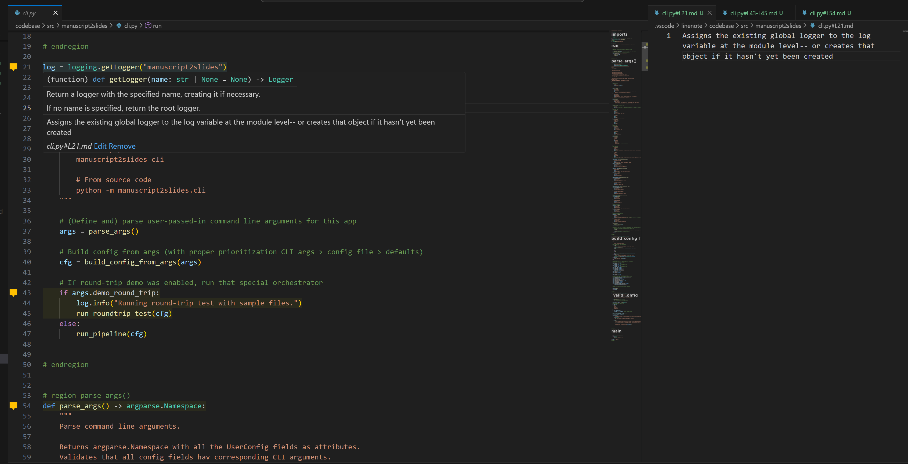
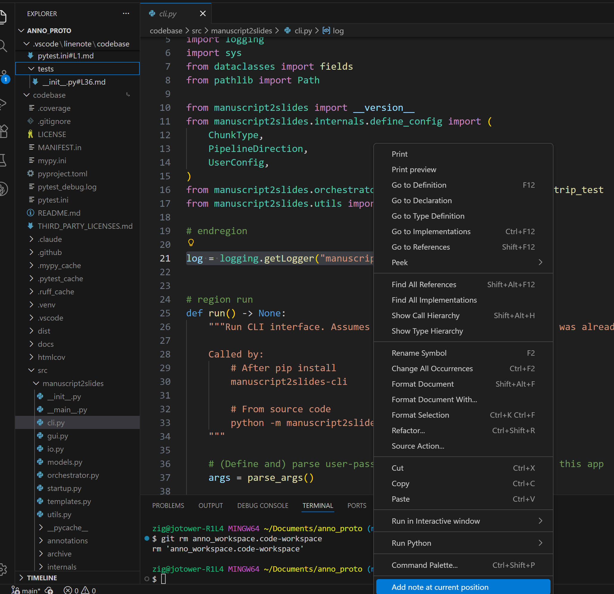
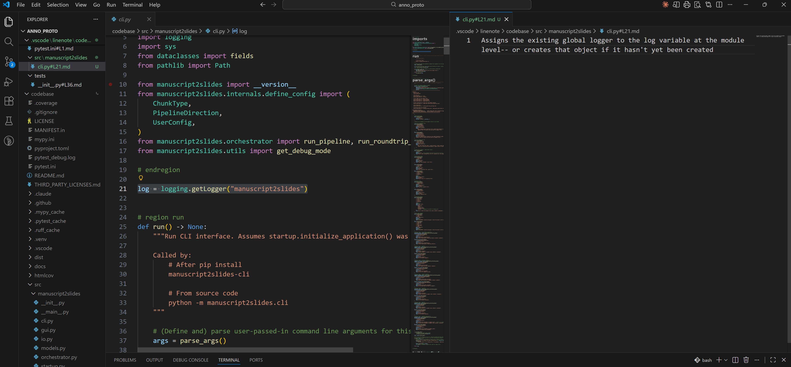
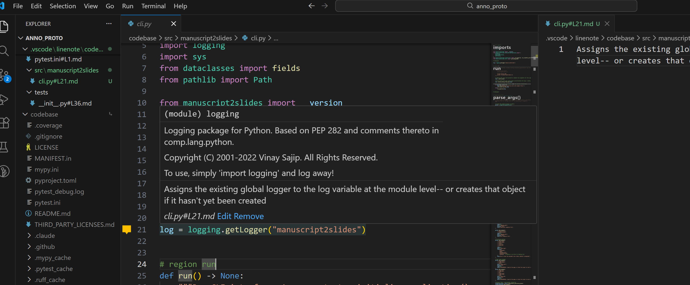
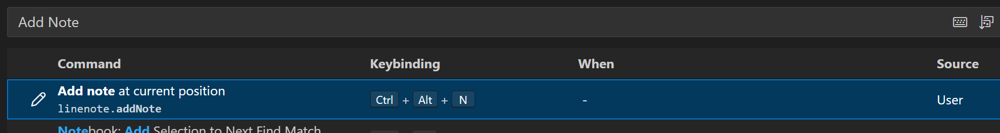

# How to Annotate Code Without Modifying Source Files

### Overview

This guide covers how to annotate a codebase you cannot or do not want to modify. Notes stay completely separate from source files. We'll use VS Code, the [Line Note Extension](https://marketplace.visualstudio.com/items?itemName=tkrkt.linenote) (MIT License), and OS filesystem junctions/symlinks to create a separate "vault" for annotations.

**Important limitation**: Annotations will be tied to specific line numbers. If the code changes (lines added/removed, files moved around), you'll need to manually update your notes. This works best for stable codebases or when you include enough context in notes to relocate them manually.

**Example use case**: When I'm working on my own code or a forked open source repository, I can just use code comments to annotate as I read line-by-line. I do this to help myself learn it, internalize, and make sure I truly understand what code is doing. But what about when there is not a way to fork the code? Perhaps the version control system (VCS) used by the team doesn't allow for that sort of branching, or for whatever reason, I don't want to pollute the original code files with comments as I read through. I want a way to take notes and associate those notes with specific parts of code in my IDE, like I would with MS Word's inline comments feature.

---

MS Word's inline comment feature:



How our VS Code + Line Notes workflow will look after setup:



---

### Prerequisites

This guide assumes more prerequisites than most on this site. We assume you:
- Are comfortable using the shell/terminal/command line in your operating system to do things like navigate the file system and create directories
- Have VS Code installed and know the basics, including how to install & use extensions

### Goal

Set up a system to annotate code with visual indicators, keeping notes separate from source code.

---

## Set up folder structure and junction

Create a vault folder and navigate to it:
```bash
# Windows
mkdir C:\my_notes_vault
cd C:\my_notes_vault

# Unix/Mac
mkdir -p ~/my_notes_vault
cd ~/my_notes_vault
```

Make the new directory for your annotations:
```bash
mkdir my_repo_annotations
cd my_repo_annotations
```

Now we will create a junction or symlink to the codebase we want to annotate.

<details>
<summary>Why/What is this?</summary>

It's basically a pointer to the real folder, formatted in a manner where VS Code will display it as if the folder were living in this spot instead of wherever its actual parent folder is.

You don't really need to understand this in depth, just know that any changes you make in a junctioned version of a directory are going to write to the REAL directory. In other words you probably do not want to ever edit the code from here. It is intended as a read-only view for your notes. (If you are using a version control system for your code that does not allow auto-checkout on edit, then that should protect you from accidentally editing the codebase.)
</details>

Still from inside `my_repo_annotations`, create the Junction/Symlink like so:

```bash
# Windows PowerShell - use Junction
# New-Item -ItemType Junction -Path link_name -Target target_path
New-Item -ItemType Junction -Path codebase -Target C:\path\to\actual\repo

# Windows Command Prompt (cmd) - use Junction
# mklink /J link_name target_path
mklink /J codebase C:\path\to\actual\repo

# Unix/Mac - use symlink
# ln -s target_path link_name
ln -s /path/to/actual/repo codebase
```

---

## Open my_repo_annotations as the root folder in VS Code

```bash
code .
```

(Or File → Open Folder → select my_repo_annotations)

---

## Get Line Note Extension

Ensure Line Note extension is installed:

- Install from: https://marketplace.visualstudio.com/items?itemName=tkrkt.linenote
- Or in VS Code: Extensions → search "Line Note" by tkrkt

---

## Add your first annotation

Navigate to any file in `codebase/` within VS Code. Right-click on a line and select "Line Note: Add note at current position":



Write your note and save:



You'll see a visual indicator on lines with notes:



Verify the setup by checking that `.vscode/linenote/` was created in `my_repo_annotations` (not in the actual repo).

---

### (Optional) Set up a keyboard shortcut

To add notes faster, you can set up a keyboard shortcut:

1. Open Keyboard Shortcuts: File → Preferences → Keyboard Shortcuts (or `Ctrl+K Ctrl+S` on Windows/Linux, `Cmd+K Cmd+S` on Mac)
2. Search for "Line Note: Add note at current position"
3. Click the + icon to add a keybinding
4. Press your desired key combination (e.g., `Ctrl+Alt+N`)



---

### Important reminder about line number-based notes

Line Note annotations are tied to **specific line numbers** in **specific files**. If code changes (lines added/removed) or files move, notes stay at their original locations and may no longer align with the code you annotated. Include enough context in your notes (function names, code snippets) to help relocate them manually if you need to later.

---

## (Optional) Set up a local git repo for your notes

This is *extra* optional. Only follow if you want to version control your annotations with git!

In this scenario, we want a git repo for ONLY our notes, not the codebase that we're learning and annotating. Therefore, we must explicitly ignore the junctioned/symlinked version of the codebase in our .gitignore.

**Note:** If you created your annotation vault in a cloud-synced location (OneDrive, Dropbox, iCloud, etc.), be aware that syncing the `.git` folder can cause conflicts. You should probably choose EITHER git or your cloud-sync; if you choose git, move the vault out of the cloud-sync location. If you really want to try both, consider excluding the `.git` subfolder from cloud sync.

Initialize git from inside `my_repo_annotations`:

```bash
git init
```

Create a `.gitignore` file:

```bash
# Ignore the junction/symlink to the actual codebase (at root only); "codebase" should be whatever your junction/linked folder name is that you made earlier
/codebase/

# OS files
.DS_Store
Thumbs.db
```

Make your first commit:

```bash
git add .gitignore
git commit -m "Initial commit: set up annotation vault"
```

---

## What You've Accomplished

Your annotation vault is set up. You can now add notes to any code with visual line indicators, keep notes separate from source, and version control your learning. 

**Tip**: If your source code tends to move around on your local file system (e.g., after a new release/version, the parent folder's name changes), delete the old junction and recreate it pointing to the new location. Your notes in `.vscode/linenote/` will persist, though you may need to manually adjust them if file paths or line numbers have changed significantly.

---

## Further Reading

- [Line Note Extension](https://marketplace.visualstudio.com/items?itemName=tkrkt.linenote) - Official marketplace page
- [Line Note GitHub Repository](https://github.com/tkrkt/linenote) - Source code and documentation
- [ln command in Unix](https://www.unixtutorial.org/commands/ln/)
- [mklink in cmd](https://learn.microsoft.com/en-us/windows-server/administration/windows-commands/mklink)
- [SuperUser: "directory junction" vs "directory symbolic link"?](https://superuser.com/a/343079)
