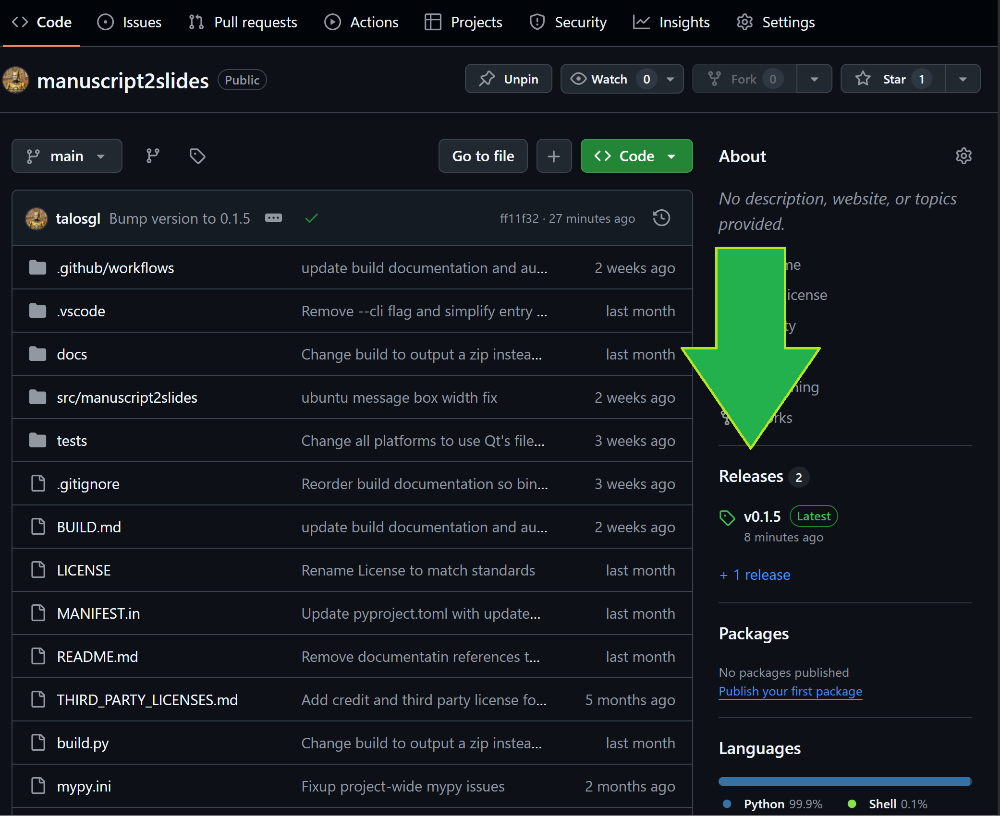
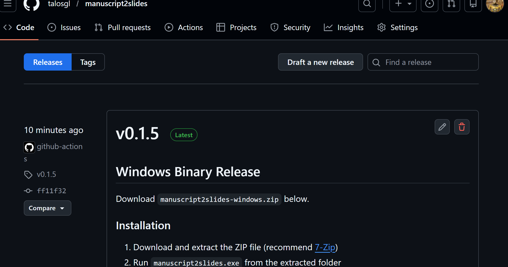
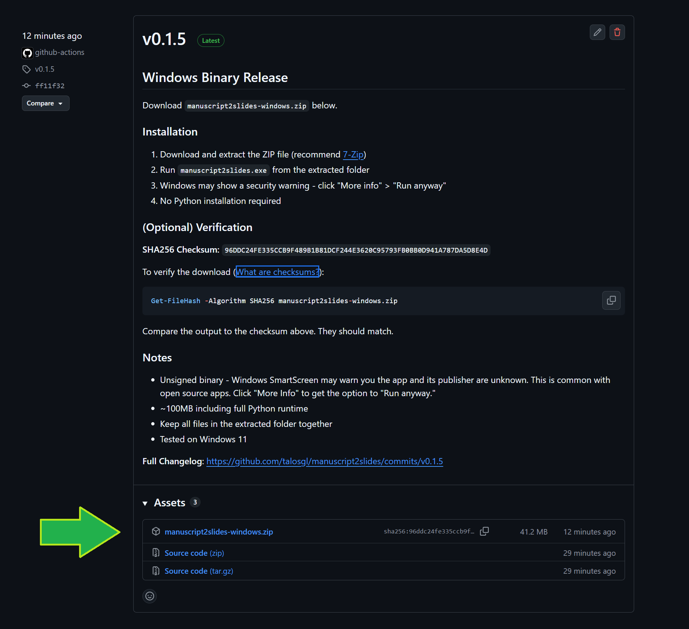
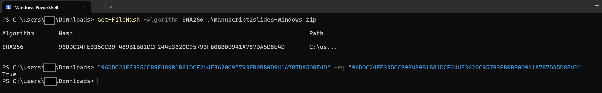
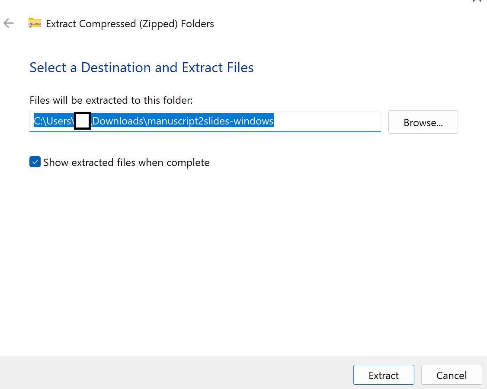
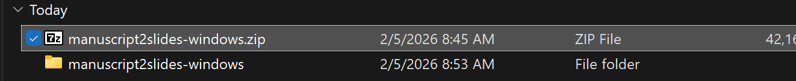

# How to Download and Install Programs from GitHub

**For:** People who want to download and use software distributed on GitHub
**Platform:** Windows (macOS guide coming later)
**Difficulty:** Beginner-friendly

---

## What is GitHub?

GitHub is a platform where developers share and host their code. Many developers release ready-to-use programs (binaries/executables) through GitHub's "Releases" feature, so you don't need to know how to code to use their software.

---

## Finding Releases

### Step 1: Navigate to the Releases Page

On any GitHub project page, look for the "Releases" section in the right sidebar:



Or, you can go directly to: `https://github.com/[username]/[project-name]/releases`, e.g., https://github.com/talosgl/manuscript2slides/releases

### Step 2: Find the Latest Release

Releases are listed chronologically, with the most recent at the top. Look for:
- **Version number** (e.g., v1.0.5)
- **Release date**
- **Release notes** explaining what's new or fixed



### Step 3: Choose Your Download

Under "Assets," you'll see the available downloads. Common file types:

| File Extension   | What It Is         | Platform             |
| ---------------- | ------------------ | -------------------- |
| `.zip`           | Compressed folder  | Windows/Mac/Linux    |
| `.exe`           | Windows executable | Windows only†        |
| `.dmg` or `.pkg` | Disk image/package | macOS only           |
| `.tar.gz`        | Compressed archive | Mac/Linux            |
| `Source code`    | Raw code files     | ⚠️ Not for end-users |
|                  |                    |                      |

If you're not sure which asset to pick, look for your operating system name (Windows, macOS, Debian, Fedora, etc.) and a .zip file.

† NOTE: Modern browsers like Chrome and Firefox, and newer versions of Windows (especially Windows 11), will flag virtually all open source software as malicious or suspicious if downloaded and distributed as a pure .exe. This is why you'll mostly see open source programs distributed as .zip.

⚠️ **Tip:** Ignore "Source code" downloads unless you're a developer who wants to modify the program.



---

## Download the File

1. Click on the `.zip` file (or appropriate file for your platform) in the Assets section
2. Your browser will download it (usually to your `Downloads` folder)
3. Wait for the download to complete

---

## (Optional) Advanced: Verify Your Download by Checksum

Some developers provide a **checksum** (a unique fingerprint for the file) to ensure what you downloaded is exactly what they uploaded and intended to distribute, and hasn't been corrupted or tampered with.

### What is a Checksum?

A checksum is like a fingerprint for a file. Every file has a unique checksum. By comparing checksums, you can verify:
- ✅ The file downloaded completely without corruption from data storage or network issues
- ✅ The file hasn't been modified or tampered with since it was originally uploaded/distributed
- ✅ You have the exact file the developer released

More info: [A good Stack Exchange post on this topic](https://security.stackexchange.com/questions/189000/how-to-verify-the-checksum-of-a-downloaded-file-pgp-sha-etc/189004#189004)

### How to Verify (Windows)

If the release notes include a **SHA256 Checksum**, you can verify it:

1. **Open PowerShell**
   - Press `Win + X` and select "Windows PowerShell" or "Terminal"
   - Or search for "PowerShell" in the Start menu
   - [Need help opening PowerShell?](https://learn.microsoft.com/en-us/powershell/scripting/windows-powershell/starting-windows-powershell?view=powershell-7.5)

2. **Navigate to your Downloads folder**
   ```powershell
   cd Downloads
   ```

3. **Run the checksum command**
   ```powershell
   Get-FileHash -Algorithm SHA256 filename.zip
   ```
   Replace `filename.zip` with the actual filename.

4. **Compare the output**
   - PowerShell will display a long string of numbers and letters
   - Compare it to the checksum in the release notes
   - They should match exactly (uppercase/lowercase doesn't matter)
   - You can copy/paste each and use the -eq operator to have PowerShell evaluate them



**What if they don't match?**
- Delete the file and redownload it
- Do NOT use the file - it may be corrupted or tampered with

---

## Extract the Files

### Windows

Windows' built-in extraction works fine, but I personally prefer [7-Zip](https://www.7-zip.org/).

1. **Right-click the `.zip` file** you downloaded
2. Select **Extract All....** to use Windows' built-in extractor, or  **7-Zip → Extract to {folder name}**
3. You'll see a new folder with the extracted contents
4. It's up to you where to store the folder; it is worth considering moving it out of your default Downloads location.






### What You'll See

After extraction, you'll typically find:
- An `.exe` file (the program itself)
- Supporting files and folders (DLLs, resources, etc.)

⚠️ **Important:** Keep all files together in the same folder. Don't move just the `.exe` file.

---
## (If Needed) Installing the Program

Many programs distributed via GitHub releases are **portable** - they run directly from wherever you extracted them, without needing a formal installation process.

### Portable Programs (Most Common)

**Characteristics:**
- No installation needed beyond extracting the .zip
- You can run the `.exe` directly from the extracted folder
- You can move the folder anywhere
- Deleting the folder = uninstalling

### If There's an Installer

Some releases include a formal installer file (`.msi`, `setup.exe`, or `install.exe`):

1. Look for a file with "setup" or "install" in the name, or ending in `.msi` (Windows)
2. Double-click to run the installer
3. Follow the installation wizard prompts
4. The program will typically install to `C:\Program Files\[ProgramName]\`

---
## Run the Program

### First Time: Windows SmartScreen Warning

Windows may show a security warning the first time you run a program:

> "Windows protected your PC"
> "Microsoft Defender SmartScreen prevented an unrecognized app from starting"


**This is normal for new programs that aren't widely downloaded yet.**

#### Why Does This Happen?

Windows SmartScreen uses "reputation-based protection." New programs or programs from smaller developers haven't built up enough downloads yet to establish trust, so Windows warns you to be cautious.

#### How to Run Anyway

If you trust the source (e.g., you verified the checksum, it's from a legitimate GitHub project):

1. Click the **"More info"** link in the body; this should reveal more options
2. Click **"Run anyway"**


**Note:** You only need to do this once. After the first run, Windows remembers and won't warn you again.

---

## Troubleshooting

### "The program can't start because [something].dll is missing"

- You may have moved only the `.exe` file instead of the whole folder
- **Solution:** Move the entire extracted folder, keeping all files together

### "Windows protected your PC" won't let me run it at all

- Some security settings block all unrecognized programs
- **Solution:** Check with your IT department or adjust Windows Defender settings (advanced)

### The program crashes or doesn't work

- Check the GitHub project's **Issues** page - others may have reported the same problem
- Look for system requirements (Windows version, dependencies, etc.)
- Try redownloading and extracting fresh

### I can't find the downloaded file

- Check your browser's **Downloads** folder
- In most browsers: `Ctrl + J` opens your download history

---

## Updating to a New Version

When a developer releases an update:

1. Download the new version from Releases
2. Extract it to a new folder (or replace the old one)
3. **Back up your settings/data first** if the program stores user data

---

## Summary Checklist

- [ ] Find the project's Releases page
- [ ] Download the appropriate file for your platform (e.g., `.zip` for Windows)
- [ ] (Optional) Verify the checksum
- [ ] Extract the files using 7-Zip or built-in tools
- [ ] Run the `.exe` file
- [ ] Click through SmartScreen warning if it appears
- [ ] Move the program folder to a permanent location
- [ ] Create shortcuts as needed

